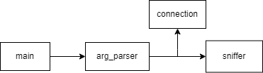
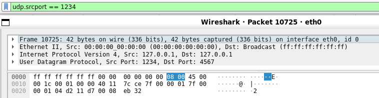

# Project 2 - ZETA: Network sniffer

Matej Olexa (xolexa03) 21.4.2024

## Obsah
[Stručný popis](#Strucny-popis)  
[Spustenie](#Spustenie)  
[Zoznam odovzdaných súborov](#Zoznam-odovzdaných-súborov)  
[Teória k implementácii](#Teoria-k-implementacii)  
[Implementacia](#Implementacia)  
[Testovanie](#Testovanie)
[Zdroje](#Zdroje)

## Stručný popis

Implementácia sledovača packetov `packet sniffer` pomocou použitia knižnice `pdap` na základe požiadavkov zadania varianty `ZETA` pre IPK [1].

## Spustenie

`./ipk-sniffer [-i interface | --interface interface] {-p|--port-source|--port-destination port [--tcp|-t] [--udp|-u]} [--arp] [--ndp] [--icmp4] [--icmp6] [--igmp] [--mld] {-n num}`

`-i | --interface` povinný parameter určujúci rozhranie na ktorom majú byť packety sledované  
`-t | --tcp` parameter určujúci zachytávanie iba TCP paketov  
`-u | --udp` parameter určujúci zachytávanie iba UDP paketov  
`-p` rozširuje parametre na určenie TCP/UDP paketov o konkrétny port, na ktorom   sú sledované pakety  
`--port-source` rozširuje parametre na určenie TCP/UDP paketov o konkrétny zdrojový port, na ktorom sú sledované pakety  
`--port-destination` rozširuje parametre na určenie TCP/UDP paketov o konkrétny cieľový port, na ktorom sú sledované pakety  
`--icmp4` zobrazí pakety typu ICMPv4  
`--icmp6` zobrazí pakety typu ICMPv6  
`--arp` zobrazí ARP rámce  
`--igmp` zobrazí pakety typu IGMP  
`--mld` zobrazí pakety typu MLD (podmnožina ICMPv6)  
`--ndp` zobrazí pakety typu NDP (podmnožina ICMPv6)  
`-n` špecifikuje počet paketov, ktoré má aplikácia zobraziť  

## Zoznam odovzdaných súborov

- `arg_parser.cpp`
- `arg_parser.h`
- `connection.cpp`
- `connection.hpp`
- `main.cpp`
- `sniffer.cpp`
- `sniffer.h`  
- `testing/py_test.py`


## Teória k implementácii

Sledovač paketov zachytáva pakety zo sieťovej komunikácie na úrovni rozhraní. Knižnica PCAP umožňuje filtráci ua zachytávanie paketov rôznych rozhraní, ktoré sú následne spracované a vypísané na stdout. Zachytávanie paketov je v svojom jadre rovnaké pre všetky typy paketov, ale v niektorých častiach spracovania sa líši. Z tohto dôvodu je hlavné sledovanie rozdelené pre IPv4, IPv6 pakety a ARP rozhranie.

### IPv4 pakety
IPv4 pakety sú základom prenosu dát pomocou `Internet Protocol version 4`. Každý paket má svoju hlavičku `header` a dáta `payload`. Hlavička obsahuje informácie o prenose dát s informáciami ako je dĺžka paketu, IP adresy a kontrolný súčet `checksum`.

Veľkosť hlavičky tohto paketu nieje vopred daná a následuju ju dáta `payload`. IP adresa je dlhá 32 bitov.[2]  

### IPv6 pakety
IPv6 pakety slúžia na prenos dát v `Internet Protocol version 6`. Každý paket má svoju hlavičku `header` a dáta `payload`. Hlavička obsahuje informácie pre prenos dát a ich doručenie, ako sú IP adresy, dĺžka paketu, `traffic class`, `flow label`, `hop limit` a ďalšie pole hlavičky, ktoré určuje aký typ dát je prenášaný v `payload`.

Veľkosť hlavičky tohto paketu je 40 byteov. Hlavička taktiež obsahuje informácie naviac, oproti IPv4 paketom. IPv6 podporuje rozšírenú hlavičku, ktorá obsahuje ďalšie informácie a rozšírenie. IPv6 pakety neobsahujú konečný súčet. IP adresa je dlhá 128 bitov a je v hexadecimálnom formáte.[3]  

### ARP pakety
ARP pakety sú používané pre mapovaní IP adries na MAC adresy na lokálnej sieti. Sú zložené z hlavičky `header` nasledovanou poľami pre zdrojovú a cieľovú MAC adresu a zdrojovú a cieľovú IP adresu. Hlavička obsahuje informácie o typu hardwareu, typ protokolu, operačného kódu `operation code` a veľkosti protokolových adries.[4]  

## Implementácia

Implementácia je rozdelená medzi parsovanie a sledovanie dát. Do `arg_parser` sa na začiatku behu programu načítajú argumenty a tie nastavia informácie v inštancii triedy `connection`. Na základe atributov objektu `connection` sa vytvoria filtre v metóde `get_filters()` inštancie triedy `sniffer`. Cez metódu `sniff()` sa následne získavajú pakety a pomocou `print_*` metód sa vypisujú jednotlivé časti dát. Každá `print_*` metóda vypíše svoju čásť dát na základe typu paketu.




## Testovanie

Program bol testovaný pomocou posielania paketov v programovaciom jazyku python pomocou knižnice `scapy`.  
Všetky následujúce testy sa nachádzajú v `py_test.py`.

Správny výstup je kontrolovaný pomocou programu wireshark [5]. Výstup z wiresharku by mal byť identický s výstupom sledovača paketov.

Príklad výstupu

```
timestamp: 2024-04-20T22:09:31+0200
src MAC: 00:00:00:00:00:00
dst MAC: ff:ff:ff:ff:ff:ff
frame length: 42
src IP: 127.0.0.1
dst IP: 127.0.0.1
src port: 1234
dst port: 4567
0x0000  ff ff ff ff ff ff 00 00  00 00 00 00 08 00 45 00  ..............E.
0x0010  00 1c 00 01 00 00 40 11  7c ce 7f 00 00 01 7f 00  ......@.|.......
0x0020  00 01 04 d2 11 d7 00 08  eb 32                    .........2
```



Potrebná knižnica pre testy 
```
from scapy.all import *
```

#### Testovanie `--port-source` a `-u`
```
ether = Ether(dst="ff:ff:ff:ff:ff:ff")
ip = IP(dst="127.0.0.1")
udp = UDP(sport=1234, dport=4567)
packet = ether / ip / udp
sendp(packet)
```
#### Testovanie `--port-destination` a `-t` 

```
ether = Ether(dst="ff:ff:ff:ff:ff:ff")
ip = IP(dst="127.0.0.1")
tcp = TCP(dport=4567)
packet = ether / ip / tcp
sendp(packet)
```


#### Testovanie  `--mld`
`./ipk-sniffer -i eth0 --mld`  

```
ip6 = IPv6(dst="ff02::1")
mld = ICMPv6MLQuery()
packet = ip6 / mld
send(packet)
```

#### Testovanie  `--ndp`
`./ipk-sniffer -i eth0 --ndp`  

```
ip6 = IPv6(dst="ff02::1") 
ndp_ns = ICMPv6ND_NS(tgt="2001:db8::1")  
packet = ip6 / ndp_ns
send(packet)
```


#### Testovanie  `--arp`
`./ipk-sniffer -i eth0 --arp`  

```
ethernet = Ether(dst="ff:ff:ff:ff:ff:ff")
arp = ARP(pdst="192.168.1.1")
packet = ethernet / arp
sendp(packet)
```

#### Testovanie  `--icmp4`
`./ipk-sniffer -i lo --icmp4`  

```
ip = IP(dst="127.0.0.1")
icmp = ICMP()
packet = ip / icmp
send(packet)
```


#### Testovanie  `--icmp6`
`./ipk-sniffer -i lo --icmp6`  

```
ip = IPv6(dst="::1")
icmp = ICMPv6EchoRequest()
packet = ip / icmp
send(packet) 
```

## Zdroje

[1][ IPK Project 2 - ZETA: Network sniffer](https://git.fit.vutbr.cz/NESFIT/IPK-Projects-2024/src/branch/master/Project%202/zeta). NESFIT. Accessed on April 10, 2024.  
[2][ What is IPv4?](https://www.geeksforgeeks.org/what-is-ipv4/). GeeksforGeeks. Retrieved April 20, 2024.  
[3][ Internet Protocol Version 6 (IPv6)](https://www.geeksforgeeks.org/internet-protocol-version-6-ipv6/). GeeksforGeeks. Retrieved April 16, 2024.  
[4][ ARP Packet Format](https://www.geeksforgeeks.org/arp-protocol-packet-format/). GeeksforGeeks. Accessed on April 20, 2024.  
[5][ Wireshark – About](https://www.wireshark.org/about.html). The Wireshark Foundation. Accessed on April 20, 2024.  

